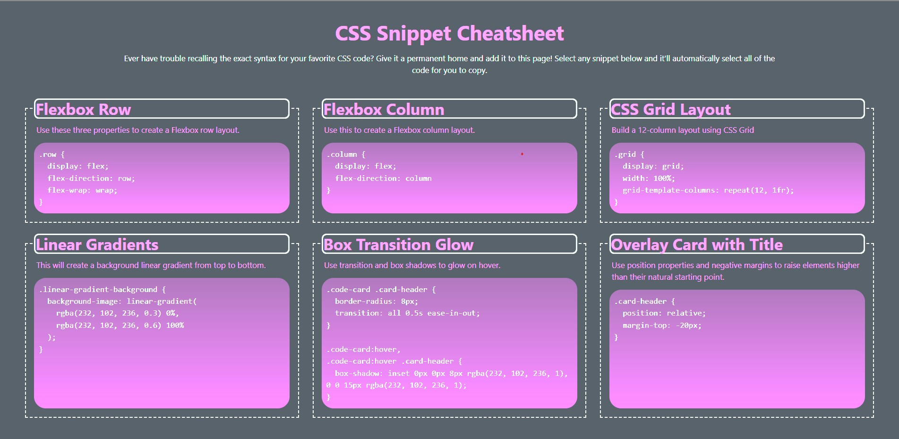

# 02 Portfolio 

## Main additions

The protfolio created provides a display of the current developed skills acquired for these first few weeks. A screenshot is provided of the look of the homepage.  

Attached are the first two main projects of building a web page for Hoerison  and the link to the cite itself. Link to Horiseon are availiable here https://github.com/VictorMontelongo/semantic-hmtl 

Additonally the mini projected work with small teams is provided to display our comprehension of CSS.  The link to the git hub work space is provided here https://github.com/VictorMontelongo/portfolio-bootcamp.git
